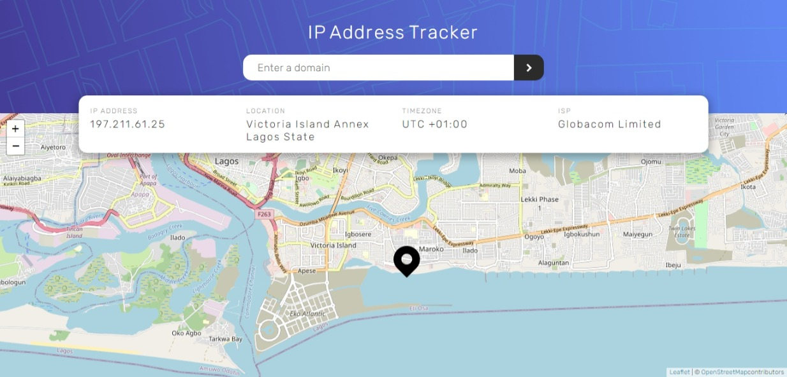

# Frontend Mentor - IP address tracker solution

This is a solution to the [IP address tracker challenge on Frontend Mentor](https://www.frontendmentor.io/challenges/ip-address-tracker-I8-0yYAH0). Frontend Mentor challenges help you improve your coding skills by building realistic projects. 

## Table of contents

- [Overview](#overview)
  - [The challenge](#the-challenge)
  - [Screenshot](#screenshot)
  - [Links](#links)
- [My process](#my-process)
  - [Built with](#built-with)
  - [What I learned](#what-i-learned)
- [Author](#author)

## Overview

### The challenge

Users should be able to:

- View the optimal layout for each page depending on their device's screen size
- See hover states for all interactive elements on the page
- See their own IP address on the map on the initial page load
- Search for any IP addresses or domains and see the key information and location

### Screenshot

### Links

- Solution URL: [solution URL here](https://github.com/code-pace/ip-address-tracker)
- Live Site URL: [Add live site URL here](https://your-live-site-url.com)

## My process

### Built with

- Semantic HTML5 markup
- CSS custom properties
- Flexbox
- CSS Grid
- Desktop-first workflow

### What I learned

This project enabled me to learn the concepts of promises while while studying the ES6 method of dealing with resolved promises I also grasped the functionality of the async and await keyword when dealing with asynchronous programs and finally most fun part of the project was working with the tile object, learnt how a object component can be created and how the functions are being called but there is still much to digest after this project.

## Author

- Website - [Chinedu Harrison Anyika](https://www.your-site.com)
- Frontend Mentor - [@code-pace](https://www.frontendmentor.io/profile/yourusername)
- Twitter - [@code_pace](https://www.twitter.com/code_pace)

